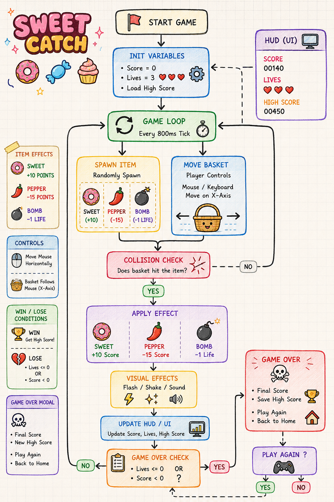

# 🧁 Sweet Catcher

Welcome to **Sweet Catcher** — a simple and fun browser-based arcade game built with **HTML, CSS, and Vanilla JavaScript**.

The goal of the game is to catch delicious sweets while avoiding dangerous objects falling from the sky. The game focuses on DOM manipulation, collision detection, animations, and game loop logic without using any external libraries or frameworks.

---

# 🖼️ Game Flow Sketch

Initial game planning created in Excalidraw:

<p align="center">
  
</p>

---

# 🎮 Live Demo

👉 GitHub Pages link here:

[PLAY THE GAME HERE](https://nuray745.github.io/sweet-catch-game/)


# 📘 AI Development Diary

[Open AI_DIARY.md](./AI_DIARY.md)

---

# 🎯 How to Play

## Controls

| Key            | Action                    |
| -------------- | ------------------------- |
| ⬅️ Left Arrow  | Move basket left          |
| ➡️ Right Arrow | Move basket right         |
| Enter / Click  | Start game                |
| Restart Button | Restart game after losing |

---

## Objective

Catch sweets to increase your score and avoid dangerous objects.

### Good Items 🍩

* Donut → +10 points
* Candy → +10 points
* Cupcake → +10 points

### Dangerous Items ⚠️

* Chili Pepper → -15 points
* Bomb → -1 life

The game ends when:

* Lives become 0
* Score becomes 0 or lower

Try to survive as long as possible and beat your high score!

---

# 🧩 Game Entities

| Entity           | Description                |
| ---------------- | -------------------------- |
| Basket           | Controlled by the player   |
| Donut            | Gives points               |
| Candy            | Gives points               |
| Cupcake          | Gives points               |
| Chili Pepper     | Removes score              |
| Bomb             | Removes life               |
| Score Board      | Displays current score     |
| Lives Counter    | Displays remaining lives   |
| Start Screen     | Appears before game starts |
| Game Over Screen | Appears after losing       |

---

# ⚙️ Technical Decisions

## Programming Approach

This project was built using the **Functional Programming** approach.

### Why Functional?

I chose the functional approach because the game is relatively small and simple.
Using functions and objects made the game logic easier to organize, debug, and update.

---

## Technologies Used

* HTML5
* CSS3
* Vanilla JavaScript
* DOM Manipulation
* localStorage
* requestAnimationFrame()

---

# 🔄 Game Loop Logic

The game uses `requestAnimationFrame()` to continuously update the game state.

Main responsibilities of the game loop:

* Move falling objects
* Detect collisions
* Update score and lives
* Render UI updates
* Remove missed objects
* Check game over conditions

---

# 💾 Persistence

The game stores the player's highest score using `localStorage`.

This allows the high score to remain saved even after refreshing or reopening the browser.

---

# 🎵 Sound & Music

Background music and sound effects were added to improve the gameplay experience and make the game more interactive and enjoyable.

---

# 🤖 AI-Assisted Development

This project was developed with the help of free AI tools.

## AI Tools Used

* ChatGPT Free
* Gemini Free

## Why AI Was Used

AI was used for:

* Brainstorming gameplay ideas
* Debugging JavaScript logic
* Improving collision detection
* Organizing project structure
* Fixing CSS layout issues

---


---

# 📂 Project Structure

```bash
sweet-catcher/
├── index.html
├── style.css
├── script.js
├── assets/          # Images (game.png, donut.png, etc.)
└── README.md
```

---

# 🚀 Features

* Player movement
* Falling object system
* Collision detection
* Score system
* Life system
* Start screen
* Game over screen
* Restart functionality
* High score saving
* Shake animation effect
* Background music and sound effects
* Dynamic UI updates

---

# 🐞 Known Bugs / Future Improvements

## Known Bugs

* Sometimes objects may slightly overlap before collision triggers.
* Rapid object spawning can occasionally make the game too difficult.

---

## Future Improvements

* Add different game levels with increasing difficulty
* Improve enemy and object balancing
* Add more visual effects and animations
* Add pause functionality
* Add mobile support
* Add power-ups and special bonuses

---

# 🧠 What I Learned

During this project I learned:

* DOM manipulation
* Collision detection logic
* Managing game state
* Using localStorage
* Structuring JavaScript projects
* Debugging with AI assistance
* Creating a game loop with requestAnimationFrame()

---

Ready your basket and start gathering the highest score! Good luck! 🍭✨
